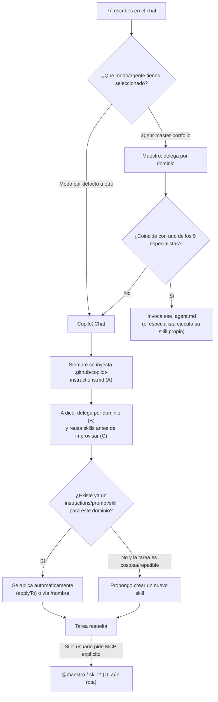

# 🧩 Solución agéntica de MiPortafolio — Mapa y funcionamiento

Documento de referencia rápida: **qué piezas agénticas existen, dónde viven, y cómo interactúas tú con cada una en VS Code.**

---

## 1. Las piezas (5 en total)

| # | Pieza | Dónde vive | Qué es realmente | Estado |
|---|-------|-----------|-------------------|--------|
| A | **Instrucciones nativas de Copilot Chat** | `.github/copilot-instructions.md`, `.github/prompts/*.prompt.md` | Configuración *nativa* de VS Code/Copilot. Se carga **automáticamente** en cada sesión de chat de este repo. | ✅ Activa (es lo que me rige a mí ahora mismo) |
| B | **Custom Agents de workspace** | `.github/agents/*.agent.md` (versionado en el repo) | Los **10 agentes especializados** (maestro + 9), seleccionables desde el picker de VS Code para cualquiera que abra este repo — no depende del perfil de cada persona. Reemplaza por completo al antiguo `.agent/AGENTS.md` (eliminado; era solo un YAML de referencia, no ejecutable). | ✅ Real y versionado |
| C | **Skills genéricos por rol** | `.github/instructions/*.instructions.md` (auto-aplicados por `applyTo`), `.github/prompts/*.prompt.md` (`/nombre`) y `.github/skills/*/SKILL.md` (bundle de conocimiento + assets) | Implementación real y portable de los "skills" de cada agente especializado. Cada skill tiene un dueño (el agente cuyo dominio coincide) — ver sección 3. | ✅ Activa |
| D | **Servidor Python "Maestro MCP"** | `agent/` (7 capas: `1_interface/` … `7_state/`) | Una app Python independiente (CLI + intento de servidor MCP) con 28 skills. Se conecta a VS Code vía protocolo MCP si arranca correctamente. | ⚠️ Roto (bug de sintaxis en `mcp_server.py`, config JSON inválida en `.vscode/settings.json`, y dos configs MCP inconsistentes entre `.mcp.json` y `.vscode/settings.json`) |
| E | **Modos de chat personalizados (perfil de usuario)** | `%APPDATA%\Code\User\prompts\*.agent.md` (tu perfil local, no está en el repo) | `agent.agent.md` y `portfolio-master-orchestrator.agent.md` siguen siendo plantillas vacías (opcional rellenarlas si quieres modos personales adicionales). | 🟡 Opcional/vacíos |

---

## 2. Los 10 agentes en `.github/agents/`

```
agent-master-portfolio (maestro, delega y coordina — NO ejecuta skills de dominio ajeno)
├── portfolio-cv-manager        → CV/Hoja de Vida
├── portfolio-test-manager      → Unit/E2E tests
├── portfolio-deployment-manager → Build & GitHub Pages
├── github-cicd-manager         → Workflows, PRs, branch protection (dueño de skill github-cli-automation)
├── setup-portability-manager   → Bootstrap/onboarding
├── devops-cicd-manager         → Release governance, delivery pipeline
├── software-architecture-manager → ADRs, SOLID, refactors
├── sdet-quality-manager        → Test strategy, flaky-test forensics
├── platform-architecture-manager → Docker/Kubernetes
└── os-platform-manager         → Windows/Linux environment parity
```

Todos viven en `.github/agents/*.agent.md`, versionados y compartidos con cualquiera que abra el repo.

---

## 3. Regla de propiedad de skills (quién ejecuta qué)

**El maestro delega, el especialista ejecuta.** Cuando una tarea coincide con el dominio de un especialista, el maestro **no** invoca el skill directamente — delega en el subagente dueño de ese skill, quien lo ejecuta.

Ejemplo: `github-cli-automation` (scripts `test.ps1`, `build.ps1`, `workflow.ps1`, `pr.ps1`) es propiedad de `github-cicd-manager`. Si el maestro recibe una tarea de CI/CD, delega en `github-cicd-manager` en vez de correr los scripts él mismo.

Esta regla está documentada en:
- `.github/copilot-instructions.md` (punto 3 de la sección "Master delegation")
- `.github/agents/agent-master-portfolio.agent.md` (punto 4 de "Behavior")
- `.github/agents/github-cicd-manager.agent.md` ("Owned skill")

Solo se usa un skill directamente (sin delegar) si ningún especialista es dueño de ese dominio.

---

## 4. Cómo funciona el flujo (diagrama)



**Puntos de intervención tuyos, en orden de frecuencia:**

1. **Selector de modo/agente** (arriba del chat): los 10 agentes aparecen **desde el repo** (B) — no dependen de tu perfil.
2. **Slash commands** (`/nombre`): disparan un `.prompt.md` de `.github/prompts/` (ej. `devops`, `sdet`, `architect`, `platform`, `sysops`, `self-heal-loop`) — complementan a los `.agent.md` equivalentes con el detalle del workflow.
3. **Confirmación al crear un skill nuevo**: cuando detecte una tarea costosa/repetible sin skill existente, te propongo crear el `.instructions.md`/`.prompt.md`/`.github/skills/` antes de hacerlo — tú confirmas.
4. **Confirmaciones de acciones sensibles**: te pido confirmación antes de un `git push`, borrar archivos, etc. — esto pasa sin importar el modo.
5. **Edición manual de `.github/agents/*.agent.md`**: es ahora la única fuente de verdad de "quién hace qué" — editarla sí tiene efecto real en mi comportamiento (ya no hay un YAML paralelo desincronizable).
6. **Aprobación de herramientas MCP** (si arreglamos D más adelante): cada vez que se invoque `@maestro` o un `skill-*`, VS Code te pedirá confirmar el permiso.

---

## 5. Resumen: qué está activo hoy vs qué falta arreglar

| Pieza | ¿Me rige ahora mismo? |
|-------|------------------------|
| A. `.github/copilot-instructions.md` | ✅ Sí, siempre |
| A. `.github/prompts/*.prompt.md` | ✅ Sí, si escribes `/devops`, `/sdet`, etc. |
| B. `.github/agents/*.agent.md` (10 agentes) | ✅ Sí, seleccionables desde el repo |
| C. `.github/instructions/*.instructions.md` / `.github/skills/*/SKILL.md` | ✅ Sí, auto-aplicado por `applyTo` o bajo demanda |
| D. Servidor MCP Maestro (`agent/`) | ❌ No — sigue roto/desconectado (pendiente) |
| E. `agent.agent.md` / `portfolio-master-orchestrator.agent.md` (perfil) | 🟡 Siguen vacíos (opcional) |

**Pendiente para una siguiente ronda:** arreglar D (bug de sintaxis + config JSON inválida + unificar `.mcp.json`/`.vscode/settings.json`) para que `@maestro` y sus skills Python sean herramientas MCP reales invocables, complementando (no reemplazando) los skills nativos de B/C.
